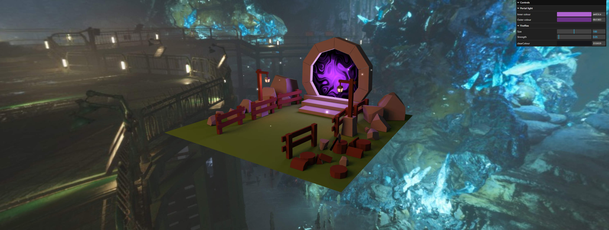

# Three.js Journey - Course by Bruno Simon
## 36 - 39 - Adding details to the portal scene
This exercise is about adding details to the portal scene from the previous exercise.  
Fireflies, lights, a skybox and a cool shader effect for the portal are added to the scene.  
The user is able to change the following parameters:  
- Portal inner colour
- Portal outer colour
- Fireflies size
- Fireflies strength (brightness)
- (clearColour does not do anything, it is just for debugging)



### Setup instructions
Download [Node.js](https://nodejs.org/en/download/).
Run this followed commands:

``` bash
# Install dependencies (only the first time)
npm install

# Run the local server at localhost:8080
npm run dev

# Build for production in the dist/ directory
npm run build
```